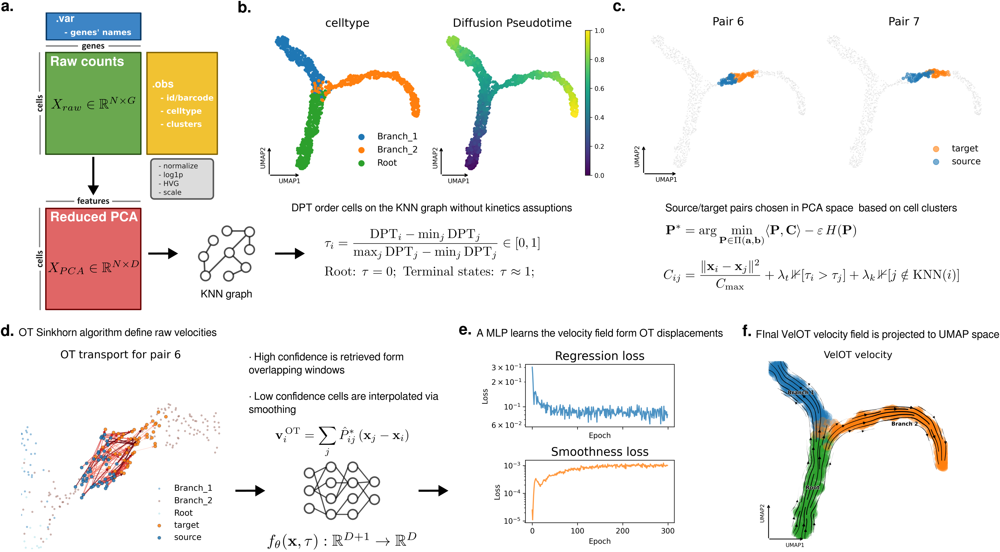

VelOT Documentation
====================

.. raw:: html

   

   
   
   
   

   

   
   
   
   
   

**VelOT** (Velocity via Optimal Transport) is a kinetic-free framework
for estimating RNA velocity from single-cell transcriptomic data.

|

Why VelOT?
----------

Existing RNA velocity methods (velocyto, scVelo) rely on modeling the
molecular kinetics of splicing and degradation, requiring
spliced/unspliced count matrices and assumptions about transcriptional
steady states that frequently fail in complex biological systems.

**VelOT takes a fundamentally different approach.** It treats velocity
inference as an optimal transport problem in gene expression space:

- **Kinetic-free**: no spliced/unspliced counts needed — works with
  any gene expression matrix.
- **Principled directionality**: pseudotime-informed cost matrices
  enforce biologically consistent forward transport.
- **Continuous velocity fields**: a neural network smoothing step
  produces a velocity function that can be evaluated at any point in
  expression space, not just at observed cell positions.
- **Robust evaluation**: built-in metrics (ICCoh, CBDir) and a
  benchmarking framework for systematic velocity quality assessment.

Key Features
------------

.. list-table::
   :widths: 30 70
   :header-rows: 0

   * - 🔬 **Preprocessing**
     - Automated pipeline with pseudotime via Diffusion Pseudotime
   * - 🪟 **Spatial-temporal windowing**
     - Two-level strategy ensuring local, biologically meaningful OT
   * - 🚚 **Optimal transport velocity**
     - Structured cost matrices with pseudotime and KNN penalties
   * - 🧠 **Neural smoothing**
     - MLP-based continuous velocity field with confidence weighting
   * - 📊 **Visualization**
     - Stream plots, trajectory analysis, metric dashboards
   * - 📏 **Evaluation**
     - ICCoh, CBDir metrics with built-in benchmarking

Quick Example
-------------

.. code-block:: python

   import velot

   adata = velot.datasets.pancreas()
   adata = velot.pp.prepare(adata, root_cluster="Ductal", cluster_key="clusters")
   velot.tl.velocity(adata)
   velot.pl.velocity_stream(adata, color="clusters")

.. toctree::
   :maxdepth: 2
   :caption: Getting Started

   installation
   quickstart

.. toctree::
   :maxdepth: 1
   :caption: Tutorials

   tutorials/erythroid_tutorial
   tutorials/pancreas_tutorial

.. toctree::
   :maxdepth: 2
   :caption: User Guide

   methodology

.. toctree::
   :maxdepth: 1
   :caption: API Reference

   api/pp
   api/tl
   api/pl
   api/metrics
   api/datasets
   api/benchmark

.. toctree::
   :maxdepth: 1
   :caption: About

   changelog
   citation
   contributing

If you use **VelOT** in your research, please cite:

.. code-block:: bibtex

   @article{velot2026,
   title   = {VelOT: kinetic-free RNA velocity inference via optimal transport,
              flow-field smoothing, and VAMP coarse-graining of cellular dynamics},
   author  = {Rincon de la Rosa, Lucas},
   journal = {bioRxiv},
   year    = {2026},
   doi     = {10.1101/2026.XX.XX.XXXXXX}
   }

Indices and tables
==================
* :ref:`genindex`
* :ref:`search`
